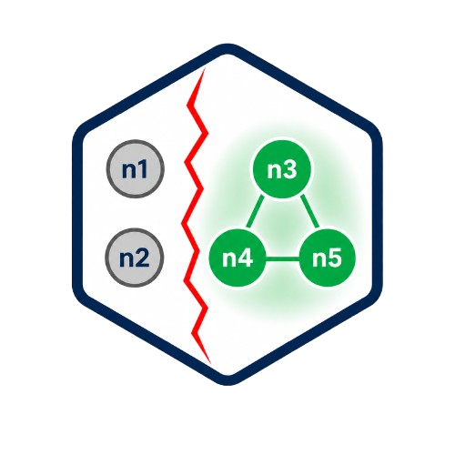
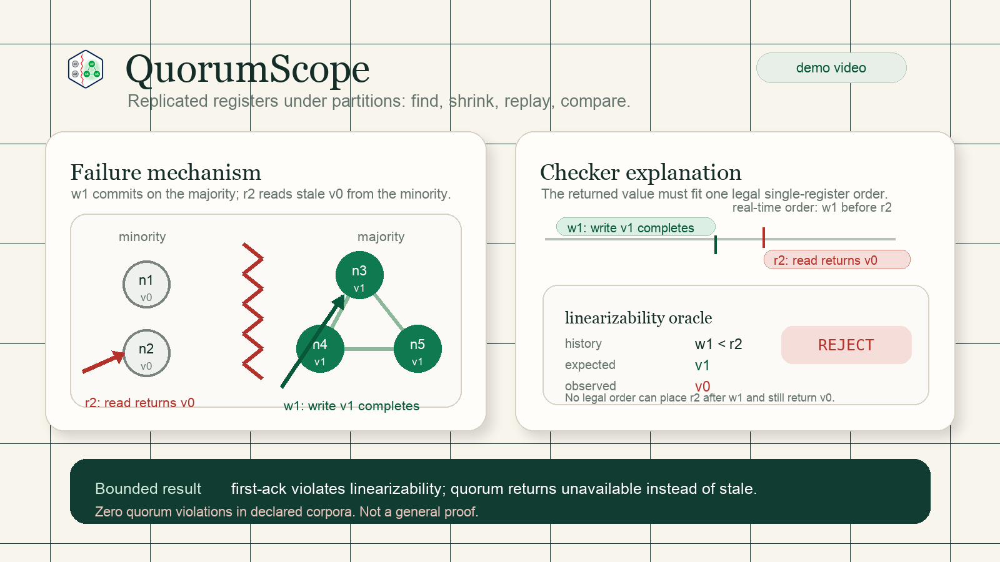
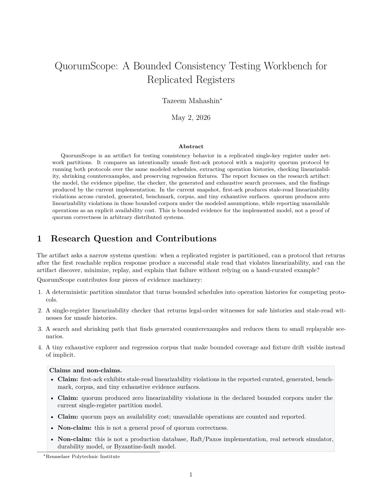
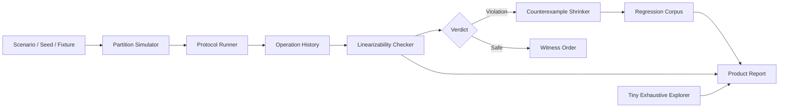

<p align="center">
  
</p>

<h1 align="center">QuorumScope</h1>

<p align="center">
  <strong>A bounded consistency-testing workbench for replicated registers under network partitions.</strong>
</p>

<p align="center">
  <a href="LICENSE"></a>
  
  
  
  <a href="paper/quorumscope.pdf"></a>
  <a href="https://youtu.be/8FtiTD_bMTE"></a>
  
</p>

QuorumScope tests a narrow distributed-systems failure mode: a replicated register can appear
healthy to local clients while producing a history that cannot fit any global linearizable order.
Under a network partition, first-ack can return a stale successful read from a minority replica
after a write has already completed on the majority side.

QuorumScope reproduces that failure, checks it with a linearizability oracle, shrinks it into a
minimal counterexample, compares the same schedule against quorum, and reports the bounded
evidence honestly.

> A successful local read is not enough. QuorumScope asks whether the resulting history can fit any
> legal single-register order.

## Preview

<table>
  <tr>
    <td align="center" width="68%">
      <a href="https://youtu.be/8FtiTD_bMTE">
        
      </a>
      <br />
      <strong>Demo video</strong>
    </td>
    <td align="center" width="32%">
      <a href="paper/quorumscope.pdf">
        
      </a>
      <br />
      <strong>Technical report</strong>
    </td>
  </tr>
</table>

## Quick Start

```bash
npm ci
npm run verify:product
npm run dev
```

Open `http://127.0.0.1:5173`.

## Why It Matters

- Local success is not global correctness; a read can return successfully from one partition while
  violating the register history observed by the whole system.
- Stale reads are subtle because every individual replica response can look ordinary.
- The checker produces witnesses and oracle diagnostics, not just pass/fail output.
- Search, shrinking, corpus replay, and the tiny exhaustive explorer make failures reproducible.
- In the modeled cases, quorum trades availability for safety by refusing minority-side operations
  instead of returning stale data.

## Current Results

All numbers below are produced by local commands in the current checkout; they are bounded to the
implemented model and declared corpora.

| Evidence surface | Cases | First-ack violations | Quorum violations | Q unavailable[^qunavailable] |
| --- | ---: | ---: | ---: | ---: |
| Regression corpus | 4 fixtures | 3/4 | 0/4 | 4 |
| Adversarial search | 50 seeds | 50/50 | 0/50 | 155 |
| Benchmark probe | 50 runs | 50/50 | 0/50 | 50 |
| Tiny exhaustive model | 1000 histories | 144 | 0 | 1064 |

[^qunavailable]: Q unavailable counts operations that quorum refused rather than returning stale data.

The exhaustive result is exhaustive only for the declared tiny model: 3 replicas, 2 clients, one key,
up to 3 returned operations, up to 2 topology changes, healed topology plus canonical 1/2 partitions,
deterministic simulator timing, and optional overlapping operation batches.

## Architecture



## Capabilities

| Component | What it does | Why it matters |
| --- | --- | --- |
| Partition simulator | Executes deterministic replica state, reachability, operation timing, commits, aborts, and unavailable operations. | Keeps every run replayable and inspectable. |
| First-ack protocol | Accepts the first reachable replica response. | Demonstrates how local success can create stale successful reads. |
| Quorum protocol | Requires majority-side acknowledgement under the same schedule. | Shows the modeled safety-vs-availability tradeoff. |
| Linearizability checker | Searches for a legal single-register order that preserves real-time precedence. | Turns traces into concrete correctness verdicts. |
| Counterexample shrinker | Greedily removes scenario steps while preserving checker failure. | Produces small, reviewable stale-read witnesses. |
| Adversarial search | Generates seeded bounded partition schedules, including overlapping batches. | Finds failures beyond the curated fixture while staying reproducible. |
| Regression corpus | Validates fixture schema, expected outcomes, provenance, and reproduction commands. | Keeps important failures durable across changes. |
| Tiny exhaustive explorer | Enumerates every case in a deliberately small finite scenario grammar. | Gives an exact denominator for one bounded model. |
| Product report | Aggregates corpus, search, benchmark, exhaustive results, and bounded claims. | Provides a single trust surface for reviewers. |
| React workbench | Replays traces, oracle diagnostics, minimized failures, and protocol comparisons. | Makes the hard technical core visible. |
| Headless UI smoke | Checks the built workbench shell and core technical surfaces. | Prevents public demo regressions without relying on manual inspection. |

## Reproduce The Main Failure

The default adversarial search starts at seed `143` and finds a first-ack stale-read counterexample.

```bash
npm run search -- --seed 143 --seeds 1 --protocol compare --nodes 5 --ops 8 --clients 3 --read-ratio 0.55 --chaos 0.75 --concurrency 0.45 --shrink
```

Expected result:

- first-ack: `NOT LINEARIZABLE`
- witness: a read returns `v0` after a completed write to a newer value
- shrinker: generated failure reduces from 11 steps to 3
- quorum comparison: zero violations, with unavailable minority-side operations reported

The first stale-read witness from the tiny exhaustive explorer is reproducible with:

```bash
npm run exhaustive -- --case ex-000043 --max-ops 3 --topology 2 --clients 2 --seed 7001 --show
```

## Workbench Demo Path

1. Run the workbench.
2. Run adversarial search.
3. Load the minimized stale-read failure.
4. Inspect the oracle diagnostics.
5. Switch from first-ack to quorum.
6. See stale success become unavailable.

## Artifact Report

This project includes a short technical report. The report badge and paper thumbnail link to the
PDF. It documents the system model, checker, counterexample search, tiny exhaustive explorer,
bounded claims, and limitations.

## Command Surface

| Command | Purpose |
| --- | --- |
| `npm run verify:product` | Full trust check: tests, typecheck, build, UI smoke, curated demo, corpus, search comparison, exhaustive explorer, and report. |
| `npm test` | Unit and regression tests. |
| `npm run report` | Product evidence report. |
| `npm run search` | Seeded adversarial search. |
| `npm run search:compare` | First-ack vs quorum adversarial comparison. |
| `npm run exhaustive` | Tiny bounded exhaustive explorer. |
| `npm run corpus` | Regression corpus replay. |
| `npm run bench` | Deterministic benchmark probe. |
| `npm run smoke:ui` | Headless UI smoke check. |
| `npm run dev` | Local React workbench. |

## Claims And Non-Claims

| Claims | Non-claims |
| --- | --- |
| First-ack produces stale-read violations in the reported bounded surfaces. | This is not a proof of quorum correctness. |
| Quorum produced zero linearizability violations in those declared corpora. | This is not a production database or consensus implementation. |
| Quorum pays an availability cost by refusing some operations. | This is not Raft, Paxos, leader election, durability, or a real network simulator. |
| Every reported failure includes a reproducible seed, fixture, command, or minimized witness. | The bounded explorer does not cover arbitrary distributed executions. |

## Model Assumptions

- The object is a single-key register.
- Partitions are modeled as reachability groups, not a real network stack.
- Successful operations are checked for linearizability; unavailable operations are reported separately.
- Quorum is a simplified majority register protocol, not Raft, Paxos, or production consensus.
- The exhaustive explorer enumerates a tiny declared scenario grammar, not all possible message
  timings or client schedules.

## Repository Layout

```text
src/core/        simulator, protocols, checker, search, shrinker, corpus, report
src/cli/         demo, search, corpus, exhaustive, benchmark, report, verification CLIs
src/App.tsx      React trace workbench
examples/        replayable scenarios and corpus manifest
tests/           deterministic unit, corpus, CLI, report, search, exhaustive, and smoke tests
paper/           artifact technical report and compiled PDF
assets/          README logo and preview images
```

## Limitations

- Single-key register only.
- Simplified network and timing model.
- Bounded adversarial search and bounded exhaustive exploration only.
- No real networking, storage, durability, crash recovery, retries, read repair, leader election,
  Byzantine faults, Raft, or Paxos.
- Exhaustive exploration is complete only within the tiny declared finite model.
- No claim of universal quorum correctness or formal verification of arbitrary systems.
- The UI is a technical trace workbench, not a general distributed-systems playground.

## License

MIT License. See [LICENSE](LICENSE).
